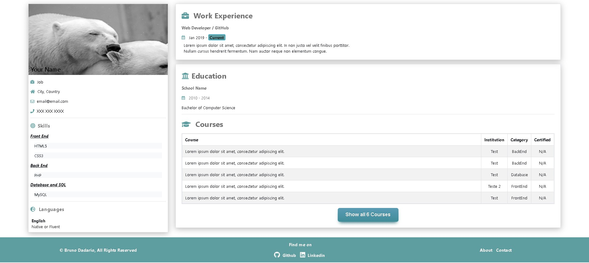
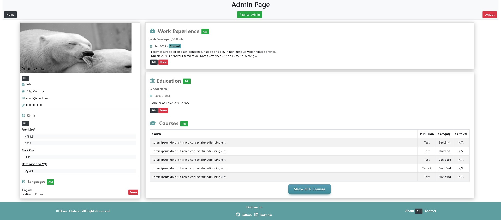
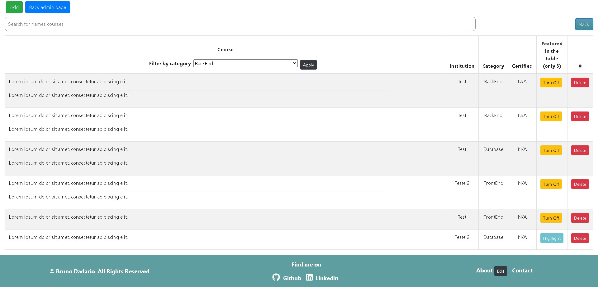
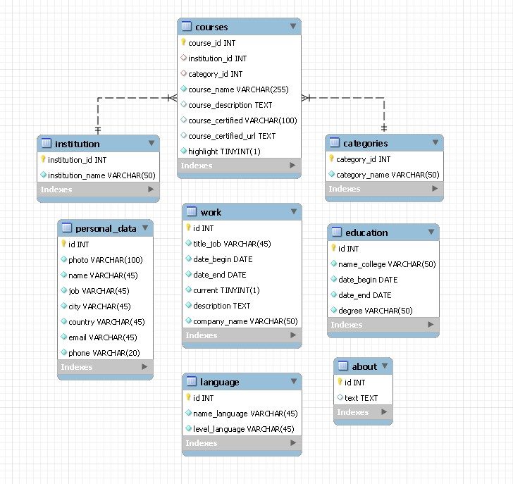

## Curriculum PHP

## About

Simple curriculum design, fully administered and managed by the website.

Front end: HTML, CSS, JavaScript and Bootstrap.

Backend: PHP & MySQL.

## Requirements

  - PHP 7.4 or higher with PDO drivers for MySQL.
  - MySQL 5.6 / MariaDB 10.0 or higher for spatial features in MySQL.
  - Composer.

## Installation
Run the command below to install all composer dependencies

    composer install

## Configuration

    CREATE DATABASE database;
    
    USE database;
    
Import SQL file that is in the repository.

    schema.sql
    
 In the config.php file, put all the necessary data to make the connection to the database.
 
    config/config.php
    
 Run development server
 
    php -S localhost:8080 -t public
    
Access by the browser.

    http://localhost:8080
    
Will open the main page

You can access the localhost admin area - <b>localhost:8080/admin</b>

    - Email : admin@admin.com
    - Password : admin

List courses section

Diagram SQL

